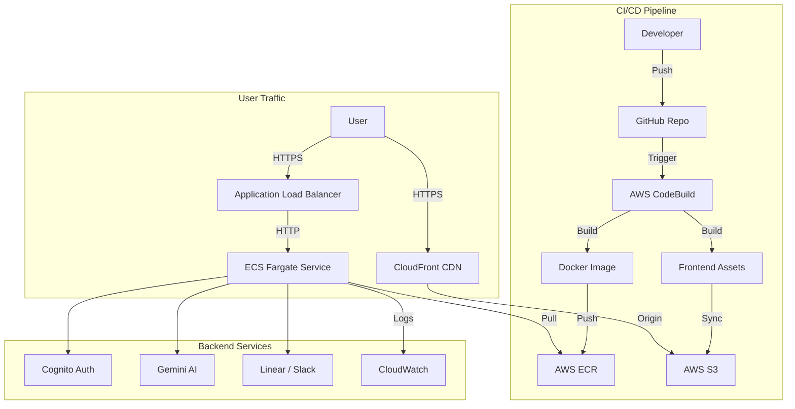

# SaaS Starter Kit with AI Features

A production-ready, multi-tenant SaaS boilerplate built for AWS, optimized for cost and scalability.

## 🏗 System Architecture



### **1. Frontend**
- **Framework**: React (Vite) + TypeScript for fast, modern UI development.
- **Styling**: Tailwind CSS + Shadcn UI for a polished, accessible design system.
- **Auth**: AWS Cognito (SRP Protocol) for secure, scalable identity management.
- **Hosting**: AWS S3 + CloudFront (CDN) for global low-latency content delivery.

### **2. Backend**
- **Framework**: FastAPI (Python 3.11) for high-performance async API endpoints.
- **AI Integration**: Google Gemini Flash (via LangChain/SDK) for cost-effective text generation and summarization.
- **Deployment**: AWS ECS Fargate (Spot Instances) for serverless container management with up to 90% cost savings.
- **API Gateway**: Application Load Balancer (ALB) for traffic distribution and SSL termination.

### **3. Infrastructure (Terraform)**
- **VPC Design**: 2 Public / 2 Private Subnets with a custom NAT Instance (replacing expensive NAT Gateways).
- **Container Registry**: AWS ECR for secure Docker image storage.
- **CI/CD**: AWS CodeBuild triggered by GitHub Actions for automated testing and deployment.

### **4. Observability**
- **Logs**: Centralized logging via CloudWatch.
- **Analysis**: Logs shipped to ELK Stack (Elasticsearch, Logstash, Kibana) for real-time monitoring and debugging.

---

## 🛠 Recent Fixes & Improvements

### **CI/CD Pipeline (CodeBuild)**
- **Docker Rate Limits**: Switched base image to `public.ecr.aws/docker/library/python:3.11-slim` to bypass Docker Hub rate limits.
- **Frontend Build Path**: Fixed `cd ./frontend` error by using absolute paths (`$CODEBUILD_SRC_DIR/frontend`).
- **Secret Security**: Removed sensitive files (`*.tfvars`) from Git history and enforced `.gitignore`.
- **Cross-Platform Compatibility**: Removed `node_modules` from git to prevent `tsc` binary conflicts during frontend build.

### **AI Reliability**
- **Quota Management**: Upgraded model to `gemini-1.5-flash-latest` for higher rate limits and better performance.
- **Connection Stability**: Fixed Upgrade 404 errors by pinning `google-generativeai` version.

### **Connectivity**
- **CORS**: Configured strict CORS on FastAPI to allow secure access from the CloudFront domain.
- **Linear Integration**: Fixed Team ID resolution for accurate issue tracking.

---

## 🚀 Getting Started

### Prerequisites
- [Docker](https://www.docker.com/)
- [Terraform](https://www.terraform.io/)
- [AWS CLI](https://aws.amazon.com/cli/)
- [Python 3.11+](https://www.python.org/)

### Quick Start
1. **Infrastructure**:
   ```bash
   cd infra
   terraform init
   terraform apply
   ```

2. **Backend (Local)**:
   ```bash
   cd backend
   pip install -r requirements.txt
   uvicorn app.main:app --reload
   ```

3. **Frontend (Local)**:
   ```bash
   cd frontend
   npm install
   npm run dev
   ```
